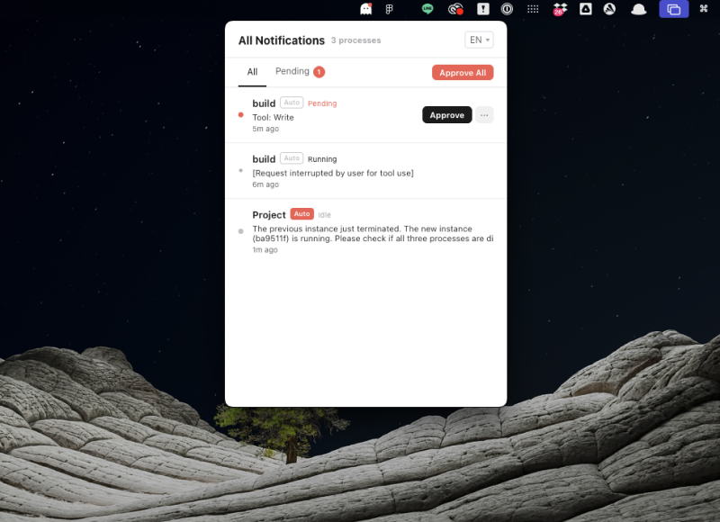

# Ghostry

A macOS menu bar app that monitors your running [Claude Code](https://docs.anthropic.com/en/docs/claude-code) sessions and lets you approve or reject tool-use prompts with a single click.



## Why?

When running multiple Claude Code sessions, you constantly switch between terminal tabs to approve tool executions. Ghostry sits in your menu bar, shows all pending approvals in one place, and lets you handle them instantly.

## Features

- **Auto-detect Claude Code sessions** — no setup required, just run `claude` as usual
- **One-click approve/reject** — approve tool use from the menu bar without switching terminals
- **Bulk approve** — approve all pending prompts at once
- **Auto-approve** — automatically approve prompts for specific projects
- **Status overview** — see which sessions are running, idle, or waiting for approval
- **Custom project names** — rename sessions for easy identification (persisted across restarts)
- **i18n** — English and Japanese support

## How It Works

1. Ghostry scans for running `claude` processes every 1.5 seconds
2. It reads session data from `~/.claude/projects/` to determine status
3. When a tool-use approval prompt is detected, it shows up in the dashboard
4. Clicking "Approve" sends the keystroke `1` via AppleScript to the correct terminal session
5. Clicking "Reject" sends `Escape` to cancel

## Requirements

- **macOS** (uses AppleScript for terminal interaction)
- **iTerm2** or **Terminal.app**
- **Claude Code** CLI installed and running

## Install

### Homebrew (Recommended)

```bash
brew tap goforward227-ctrl/ghostry
brew install ghostry
```

### Download

Download the latest `.zip` from [Releases](https://github.com/goforward227-ctrl/ghostry/releases).

> **Note:** The app is not notarized with Apple. macOS may block it on first launch.
>
> **To open:**
> 1. **Right-click** the app → **Open** → Click **Open** in the dialog
> 2. If still blocked: **System Settings → Privacy & Security** → scroll down → **Open Anyway**

### Build from Source

```bash
git clone https://github.com/goforward227-ctrl/ghostry.git
cd ghostry
npm install
npm run build:mac
```

## Development

```bash
npm install
npm run dev
```

## How to Use

1. Start Ghostry — it appears as an icon in your menu bar
2. Run `claude` in your terminal(s) as usual
3. Click the menu bar icon to see all sessions
4. When Claude Code asks for approval, click "Approve" in Ghostry

## Supported Terminals

| Terminal | Status |
|----------|--------|
| iTerm2 | Supported |
| Terminal.app | Supported |
| Warp | Not yet |
| Kitty / Alacritty | Not yet |

## Limitations

- macOS only (AppleScript dependency)
- When you select "Yes, allow all" in Claude Code for a specific action type, those prompts won't appear in Ghostry (Claude Code handles them automatically)

## License

[MIT](LICENSE)
